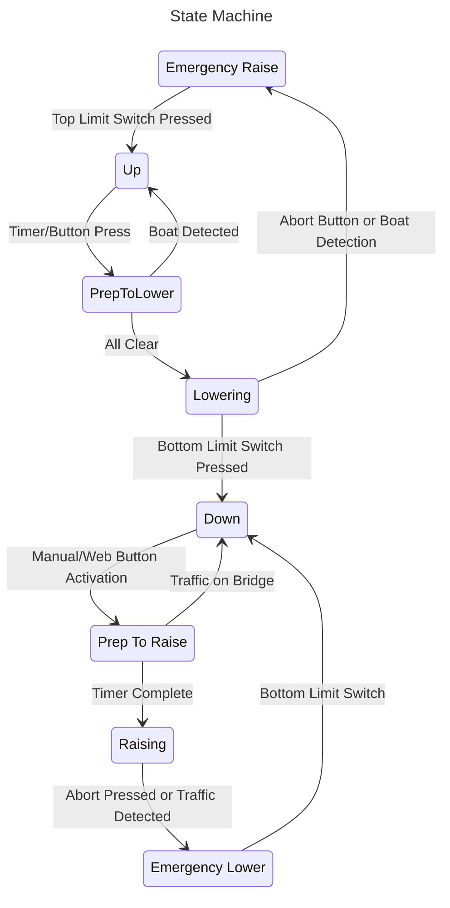

```mermaid
---
title: State Machine
---
stateDiagram-v2
    D:Down
    PTR:Prep To Raise
    R:Raising
    EL:Emergency Lower
    ER:Emergency Raise
    L:Lowering
    U:Up
    PTL:PrepToLower

    D --> PTR : Manual/Web Button Activation
    PTR --> D : Traffic on Bridge
    PTR --> R : Timer Complete
    R --> EL : Abort Pressed or Traffic Detected
    ER --> U : Top Limit Switch Pressed
    EL --> D : Bottom Limit Switch
    U --> PTL : Timer/Button Press
    PTL --> U : Boat Detected
    PTL --> L : All Clear
    L --> D : Bottom Limit Switch Pressed
    L --> ER : Abort Button or Boat Detection

    
```